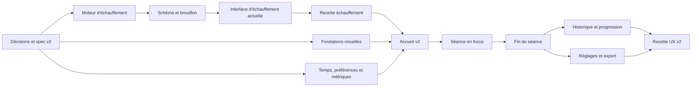

# Roadmap proposée — refonte UX et échauffement

Statut : **proposition à faire valider par Ugo et Claude avant création des tickets**.

Sources examinées dans le dossier de conception `carnet-de-barre-ux-echauffement/`, présent au moment de la revue dans le worktree Codex :

- `carnet-de-barre-ux-echauffement/01-echauffement.md` ;
- `carnet-de-barre-ux-echauffement/02-refonte-ux.md` ;
- `carnet-de-barre-ux-echauffement/maquette-ux.html` ;
- l'application, ses tests, `SPEC.md`, `PLAN.md` et `AGENTS.md` dans leur état actuel.

La maquette fixe l'intention visuelle et les parcours. Elle ne doit pas devenir une seconde implémentation de référence : les règles métier validées seront écrites dans la spec et le domaine TypeScript, puis la maquette restera une référence de rendu.

## 1. Ordre recommandé

Je recommande deux livraisons distinctes :

1. **Échauffement complet dans l'interface actuelle.** On stabilise d'abord les calculs, la migration, la reprise d'un brouillon et l'export. Cette livraison apporte une valeur autonome et permet de tester le nouveau comportement sans le confondre avec une refonte de navigation.
2. **UX v2 par tranches verticales.** On remplace ensuite l'accueil, la séance en focus, la fin de séance, puis les écrans secondaires. Chaque tranche est accessible depuis le vrai point d'entrée et laisse la production utilisable.

Les fondations visuelles qui ne dépendent pas des contrats d'échauffement peuvent avancer en parallèle, mais le nouvel écran de séance ne doit être branché qu'après la livraison de l'échauffement.

## 2. Décisions à figer avant le code

Ces points modifient les décisions D1–D10 ou la structure des données. Après arbitrage d'Ugo, ils doivent être consignés dans `SPEC.md`, `PLAN.md` et, si nécessaire, `AGENTS.md`. Les choix ci-dessous sont mes valeurs par défaut proposées.

| Sujet | Constat | Proposition par défaut |
|---|---|---|
| Sélection A/B/C | D7 exige une séance manuelle toujours possible ; la maquette retire le sélecteur pendant la séance. | Garder A/B/C sur l'accueil avant « Démarrer ». Une fois la séance commencée, masquer le sélecteur et les onglets, avec une action visible pour quitter la vue ou abandonner le brouillon. |
| Début et durée | Le brouillon est actuellement créé avant le premier geste ; son `createdAt` ne mesure donc pas la séance. | Ajouter `startedAt` au clic « Démarrer » et `completedAt` à la finalisation. Calculer la durée depuis ces instants et les exporter de façon additive. |
| Mode pressé | Q4 désactive les exercices 3+, tandis que le nouveau document réduit aussi les séries d'échauffement. | Conserver Q4. Ne réduire aucun échauffement sans règle explicite validée par Ugo ; permettre de passer une série individuellement. |
| Optionnels | La décision actuelle garde élévations, curls et face pulls en texte libre ; la maquette les transforme en séries structurées. | Garder le texte libre dans la première livraison UX. Traiter leur structuration comme une évolution métier séparée si Ugo la souhaite. |
| Arrondi des échauffements | L'exemple deadlift 92,5 kg donne 85 kg à 90 %, alors que l'arrondi au pas le plus proche donne 82,5 kg. Les autres exemples suivent l'arrondi au plus proche. | Retenir « pas disponible le plus proche, égalité vers le haut » et corriger l'exemple à 82,5 kg, sauf si 85 kg est un choix volontaire à formaliser. |
| Départ du deadlift | « 60 kg avec disques de 25 » est incompatible avec une barre de 20 kg : deux disques de 25 donnent 70 kg. | Fixer le plancher à 60 kg avec 20 kg par côté, puis confirmer si le besoin réel porte plutôt sur la hauteur des disques disponibles. |
| Échauffement d'accessoire | « Premier mouvement à froid » ne peut pas être déduit fiablement du nom de l'exercice. | Déclarer dans le programme une politique explicite par exercice : complet, réduit ou aucun. Aucun raisonnement implicite par groupe musculaire dans l'interface. |
| Petites charges | Sous 60 kg, des paliers peuvent être identiques à la barre, entre eux ou au top set. | Produire une suite strictement croissante, supprimer les doublons et toute série égale ou supérieure à la série de travail. Le cas tractions lestées reste une politique dédiée. |
| Série modifiée | Un recalcul peut écraser une saisie déjà faite. | Recalculer uniquement les séries d'échauffement encore vierges et non modifiées ; préserver toute série validée ou éditée, comme pour les backoffs. |
| Brouillon déjà ouvert | Une mise à jour pourrait injecter des séries au milieu d'une séance commencée. | Générer les échauffements seulement à la création d'un nouveau brouillon. Ne jamais migrer le contenu d'un brouillon actif en place. |
| Tonnage | La maquette affiche un tonnage sans formule définie. Haltères, lest, presse et échauffements rendent le chiffre ambigu. | Ne pas afficher le tonnage avant une formule validée. Si retenu : définir séparément charge externe, multiplicateur haltères, poids du corps et inclusion des échauffements. |
| e1RM et record | La formule et la notion de record ne sont pas encore arrêtées. Les chiffres de la maquette sont illustratifs. | Créer un ticket métier dédié ; ne montrer aucune valeur fictive. Choisir la formule, les rôles de séries admissibles et la règle de comparaison avant l'interface. |
| Bloc « semaine 1/8 » | Aucune date de début, règle de passage ni conduite après la semaine 8 n'existe dans les données. | Masquer ce bloc tant que son cycle n'est pas spécifié. Le reste de l'accueil peut être livré sans lui. |
| Tendances du jour | Les flèches de tendance n'ont pas de période ni de population définies. | Comparer le dernier top set valide au précédent du même lift ; afficher « — » si la comparaison est impossible. Faire valider cette définition avec les métriques. |
| Polices | La maquette charge Google Fonts, incompatible avec l'offline complet et D10. | Embarquer les fichiers WOFF2 et leurs licences dans les assets, ou choisir des polices système si leur redistribution n'est pas validée. Aucun appel réseau à Google Fonts. |
| Chrono écran verrouillé | La maquette annonce un fonctionnement écran verrouillé que la PWA ne garantit pas, surtout sur iOS. | Conserver la réponse Q3 : échéance persistée, recalcul au retour, son/vibration si disponibles, sans promesse d'alarme lorsque l'app est suspendue. |
| Réglages | Vibration, son, écran allumé, mode pressé par défaut et matériel n'ont pas tous un contrat de persistance. | Stocker des préférences locales versionnées via `src/db/`. Rendre le matériel éditable seulement après validation de son effet sur les anciens brouillons et les calculs. |

Le document `01-echauffement.md` montre un bloc repliable, tandis que l'UX en focus demande une seule série à la fois. Les deux peuvent coexister : la première livraison utilise un bloc dans l'écran actuel ; l'UX v2 transforme ensuite chaque série d'échauffement en étape de la file de séance.

## 3. Lot E — Échauffement fonctionnel

Les numéros sont provisoires. Claude attribuera les prochains identifiants CB/Linear libres après validation.

### E0 — Contrat d'échauffement

**Responsable proposé : Claude.**

- Reporter les arbitrages ci-dessus dans les sources de vérité.
- Définir une politique d'échauffement explicite pour chaque exercice concerné.
- Écrire les exemples canoniques attendus, y compris charges basses, haltères, tractions lestées et deadlift.
- Définir le comportement d'une série passée : conservée dans le journal avec un état explicite ou absente des `sets`. Je recommande un état explicite afin que la reprise et l'export reproduisent la séance.

Acceptation : chaque entrée du programme a une politique non ambiguë et les exemples donnent un résultat unique avant toute implémentation.

### E1 — Moteur pur

**Responsable proposé : Claude — `src/domain/`.**

- Ajouter le rôle `warmup` et un calcul pur à entrées/sorties explicites.
- Utiliser les pas de charge du programme existant.
- Dédupliquer les charges et garantir leur ordre ainsi que leur position sous la charge de travail.
- Couvrir les politiques complet/réduit/aucun et le mode pressé une fois arbitré.
- Tester des scénarios synthétiques à résultat connu, dont tous les exemples validés en E0.

Acceptation : aucun import React/DOM, aucune lecture de base, et les plans de chauffe canoniques passent sous Vitest.

### E2 — Schéma, migration et dérivations

**Responsable proposé : Claude — `src/domain/` et `src/db/`.**

- Incrémenter `schemaVersion` et accepter encore le seed historique ainsi que les exports v1.
- Préserver les séries `warmup` dans un export/import v2.
- Les exclure de `tops`, `lines`, progression, échecs et records.
- Faire évoluer Dexie sans perdre séances, cibles ni brouillon.
- Refuser une version future avant toute écriture, comme aujourd'hui.

Acceptation : aller-retour v2 identique, import v1 compatible, migration de base testée, et une série d'échauffement ne peut modifier aucune cible.

### E3 — Création et mise à jour du brouillon

**Responsables proposés : Claude pour `src/db/`, Codex pour `src/features/session/useDraftEditor.ts`.** Deux tickets et deux PR si les fichiers des deux propriétaires doivent changer.

- Générer le plan de chauffe à l'ouverture d'un nouveau brouillon.
- Ne rien injecter dans un brouillon actif créé par une ancienne version.
- Recalculer les séries vierges après modification de la charge de travail.
- Préserver les séries éditées, validées ou passées.
- Maintenir l'écriture au fil de l'eau et la reprise exacte après rechargement.

Acceptation : un test sur vraie base couvre création, modification du top set, validation partielle, rechargement et finalisation.

### E4 — Interface d'échauffement dans l'écran actuel

**Responsable proposé : Codex — `src/features/session/` et `src/components/`.**

- Afficher le bloc avant la série de travail, avec charge, reps et plaques lorsque pertinentes.
- Préremplir chaque série et la valider en un geste.
- Permettre de passer une série avec un contrôle tactile d'au moins 44 px.
- Replier le bloc achevé sans masquer son état.
- Ne pas démarrer le chrono après une série `warmup`.
- Annoncer sur l'accueil le nombre de séries et une durée estimée seulement si la formule est validée.

Acceptation : parcours complet utilisable à 390–400 px, au clavier et au toucher ; aucun déplacement de mise en page lorsque le chrono est absent.

### E5 — Porte de livraison échauffement

**Responsable proposé : Codex pour le parcours E2E, Claude pour la contre-revue.**

- Parcours Playwright : démarrer, valider deux séries de chauffe, vérifier l'absence de chrono, recharger, reprendre, faire une série de travail, finaliser et exporter.
- Vérifier que la progression obtenue est identique avec ou sans séries de chauffe.
- Vérifier import historique, export v2 et mise à jour PWA pendant un brouillon.
- Ajouter la recette sur téléphone réel dans `docs/RECETTE.md`.

Porte : `npm run check`, jobs GitHub `check`/`e2e`, preview Vercel et contre-revue sur le SHA exact.

## 4. Lot U — UX v2

### U0 — Contrat d'interaction et inventaire des écrans

**Responsable proposé : Codex.**

- Transformer la maquette en états réels : avant séance, séance démarrée, série en cours, chrono actif, exercice facultatif, finalisation, brouillon repris, erreur d'écriture et app offline.
- Produire une petite matrice « action → persistance → écran suivant ».
- Définir les actions accessibles sans geste : « Précédente », « Passer », sortie de la vue focus. Le swipe reste un raccourci.
- Faire valider le texte français et supprimer toutes les promesses non garanties.

Acceptation : aucun écran ni nombre de la maquette ne dépend de données illustratives.

### U1 — Fondations visuelles

**Responsable proposé : Codex — `src/components/`, assets et réservation de `src/index.css`.**

- Définir couleurs, typographie, espacements, rayons, états de focus et safe areas.
- Créer les primitives réutilisées : barre de plaques, barre de progression, carte de série focus, navigation basse, boutons et feuilles basses.
- Ajouter `prefers-reduced-motion` dès les primitives.
- Garder le bundle offline ; aucune nouvelle dépendance directe.

Acceptation : catalogue de composants testé dans les écrans/tests existants, contraste vérifié et cibles tactiles d'au moins 44 px.

### U2 — Données nécessaires à l'UX

**Responsable proposé : Claude — `src/domain/` et `src/db/`.**

- Ajouter les instants de début/fin et la durée suivant l'arbitrage.
- Ajouter le stockage des préférences locales retenues.
- Livrer les sélecteurs de données pour accueil, fin et progression sans logique métier dans React.
- Si e1RM, record ou tonnage sont validés, les calculer dans des modules purs avec tests dédiés ; sinon exposer clairement leur indisponibilité et ne pas rendre les cartes.

Acceptation : contrats documentés, migration additive et valeurs reproductibles sur des scénarios connus.

### U3 — Accueil v2 et démarrage explicite

**Responsable proposé : Codex — `src/features/session/`, avec réservation de `src/App.tsx`.**

- Afficher séance prévue, date Zurich, contenu, mode pressé et résumé d'échauffement.
- Garder le sélecteur A/B/C avant démarrage.
- Créer `startedAt` seulement au clic « Démarrer ».
- Reprendre un brouillon existant au lieu d'en créer un second.
- Omettre les blocs semaine/tendance non encore définis.

Acceptation : l'accueil est le vrai point d'entrée, les séances manuelles restent possibles et un simple affichage de l'accueil ne fausse plus la durée.

### U4 — Séance en focus

**Responsable proposé : Codex — `src/features/session/` et `src/components/`.**

- Construire une file plate à partir des séries du brouillon ; le curseur courant est dérivé de la première série à faire et ne crée pas un second état métier.
- Montrer une seule série principale avec les contrôles adaptés à son rôle.
- Attendre la réussite de la persistance avant l'avance automatique ; rester sur la carte et expliquer l'erreur en cas d'échec.
- Afficher le chrono à emplacement stable, sans le lancer après l'échauffement.
- Permettre retour, correction et passage par boutons visibles ; ajouter le swipe comme raccourci.
- Masquer la navigation globale pendant la séance selon l'arbitrage, tout en conservant une sortie explicite.

Acceptation : rechargement et retour au premier plan reprennent la bonne série et le bon chrono ; les 23/22/16 séries annoncées ne sont utilisées qu'après vérification contre le programme réel.

### U5 — Fin de séance

**Responsable proposé : Codex — `src/features/session/`.**

- Afficher résumé, notes et prochaines cibles issues du résultat réel de finalisation.
- Présenter uniquement les métriques validées et calculées.
- Conserver la finalisation idempotente et le refus explicite des cibles devenues obsolètes.
- Relier directement l'écran à l'accueil ou à l'historique.

Acceptation : double clic, rechargement et second onglet ne peuvent créer deux séances ni appliquer deux fois la progression.

### U6 — Historique, édition et progression

**Responsable proposé : Claude — `src/features/history/` et domaine associé.**

- Regrouper les séances par semaine sans changer leur date métier.
- Afficher détails, modification et suppression avec les protections D6 existantes.
- Ajouter l'écran Progression seulement avec des métriques réelles et leurs états vides.
- Brancher l'écran et son entrée de navigation dans la même PR que chaque nouvel écran utilisateur.

Acceptation : les 12 séances du seed restent fidèles ; modifier ou supprimer une séance ne change jamais une cible.

### U7 — Réglages, export et coque de navigation

**Responsable proposé : Codex — `src/features/export/`, `src/components/`, avec réservation de `src/App.tsx`.**

- Rassembler export/import et préférences validées dans Réglages.
- Conserver le format versionné `targets` + `seances`, la validation complète, l'export préalable et le remplacement atomique.
- Afficher la dernière sauvegarde seulement si une source fiable existe.
- Finaliser les quatre onglets hors séance et leur masquage en séance active.

Acceptation : chaque écran est atteignable depuis l'application ; l'import reste impossible pendant un brouillon actif et l'export reste consommable par la tâche Outlook.

### U8 — Porte de livraison UX v2

**Responsable proposé : Codex pour E2E/recette, Claude pour contre-revue et tests d'intégration DB.**

- Étendre `src/App.test.tsx` à chaque nouvel écran et à la navigation réelle.
- Étendre le parcours Playwright : accueil → échauffement → séance focus → chrono → finalisation → historique → export.
- Vérifier 390 px et 400 px, safe area, clavier ouvert, mode réduit, reprise offline et mise à jour disponible.
- Faire la recette sur le téléphone et le navigateur choisis par Ugo.
- Comparer la production à la maquette écran par écran avec des données réelles.

Porte : tous les contrôles verts sur le SHA de tête, contre-revue sans P1, branche à jour de `main`, puis vérification de l'URL de production.

## 5. Répartition proposée

### Claude

- Arbitrages et mise à jour des sources de vérité avec Ugo.
- Moteur d'échauffement, programme et tests purs.
- Schéma v2, migration Dexie, création du brouillon et dérivations.
- Temps, préférences, métriques et sélecteurs de données.
- Refonte de l'historique et de la progression.
- Contre-revue des PR d'interface de Codex.

### Codex

- Contrat d'interaction issu de la maquette.
- Composants et fondations visuelles offline.
- Interface d'échauffement, recalcul côté éditeur et parcours E2E.
- Accueil, séance en focus, chrono, fin de séance.
- Réglages/export et coque de navigation.
- Accessibilité, responsive mobile, recette et contre-revue des PR de Claude.

Cette répartition suit la propriété actuelle des fichiers. Un changement qui traverse `src/db/` et `src/features/session/` devient deux tickets reliés plutôt qu'une PR à deux auteurs.

## 6. Règles de découpage et de livraison

- Un ticket porte un résultat vérifiable, une branche et une PR. Les identifiants ci-dessus ne sont pas encore des tickets.
- Les fichiers partagés sont réservés dans Linear avant le premier changement.
- Les PR de contrat peuvent précéder leur interface si le ticket consommateur est nommé. Tout nouvel écran est livré avec son point d'entrée.
- Chaque correctif de régression est éprouvé en retirant temporairement le correctif pour constater que le test échoue.
- Aucune nouvelle dépendance n'est prévue. Les polices éventuelles sont des assets locaux avec licence consignée.
- La configuration du service worker ne recharge jamais l'app pendant une séance active.
- Une livraison peut masquer une métrique indéfinie ; elle ne peut jamais afficher une donnée de démonstration comme une donnée réelle.
- La fusion suit `AGENTS.md` : contrôles GitHub et Vercel verts, contre-revue signée sur le SHA exact, branche à jour, squash par l'auteur.

## 7. Risques à suivre

| Risque | Réponse prévue |
|---|---|
| Régression de progression causée par les warmups | Rôle dédié et exclusion au niveau du domaine, test d'intégration sur vraie base. |
| Perte ou mutation d'un brouillon lors de la migration | Pas d'injection dans un brouillon existant, migration Dexie testée avant l'UI. |
| Refonte trop large à relire | Tranches verticales E puis U, chacune déployable et accessible. |
| Double état entre la file UX et le brouillon | Curseur dérivé des séries persistées. |
| Avance automatique avant sauvegarde | Attente de l'écriture et état d'erreur local visible. |
| Maquette fondée sur des chiffres fictifs | États vides et métriques masquées jusqu'au contrat métier. |
| Offline cassé par les polices ou assets | Ressources embarquées et scénario Playwright offline. |
| Conflits Claude/Codex sur App et styles | Réservation explicite et séquence U1 → U3/U4 → U7. |
| Geste inaccessible ou peu découvrable | Boutons visibles équivalents au swipe, focus clavier et libellés explicites. |
| Promesse erronée du chrono en arrière-plan | Texte conforme aux limites déjà décidées et recette sur appareil réel. |

## 8. Validation attendue avant création des tickets

Claude doit vérifier la faisabilité du découpage et les frontières de fichiers. Ugo arbitre les lignes du tableau de la section 2, en particulier l'arrondi, le deadlift, le mode pressé, les optionnels, les métriques et le bloc de huit semaines.

Une fois ces réponses consignées, Claude peut créer les tickets E0 à U8 avec leurs dépendances et réservations. Le premier code à fusionner est E1 ; la première bascule visuelle en production est E4 ; la bascule complète vers l'UX v2 arrive à U4, après la porte E5.
